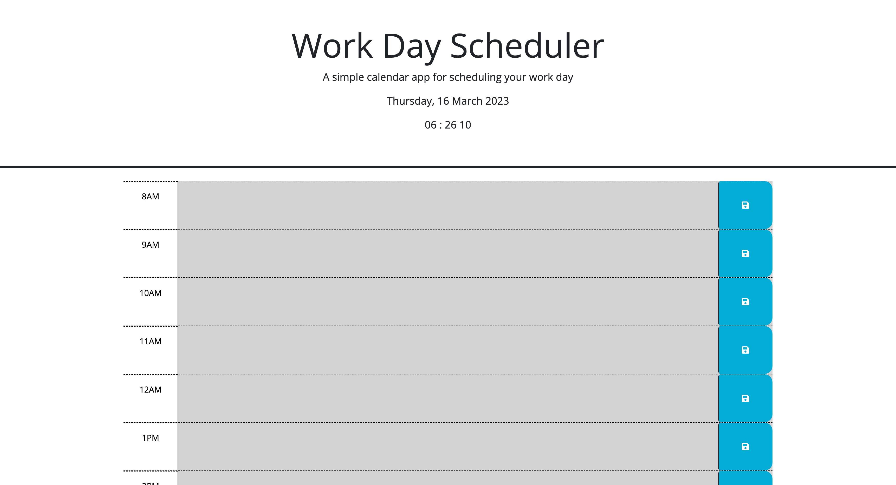

# Project name
Calender application
## Description
- The App allows a user to organize their working day by keeping a hour by hour record of tasks for the day. 
## Table of contents
  - [Description](#description)
  - [Overview](#overview)
  - [Screenshot](#screenshot)
  - [Links](#links)
  - [Built with](#built-with)
  - [Author](#author)
  - [license](#license)

## Overview
Users should be able to interact with the application and view the following:

- Save events for every hour of the working day
- Delete events
- see the color of the hours change depending on the current time of day
- see the current time and date displayed on the dashboard

### Screenshot
 
### Links

- GitHub URL: [Travisnicholson90](https://githubproject)
- Live Site URL: [netlify](https://euphonious-quokka-8c5150.netlify.app)

### Built with

- HTML
- CSS
- Bootstrap
- JavaScript
- jQuery
## Author

- Website - [Travis Nicholson](https:livesite)
- GitHub - [Travisnicholson90](https://github.com/Travisnicholson90)

## License

MIT license

